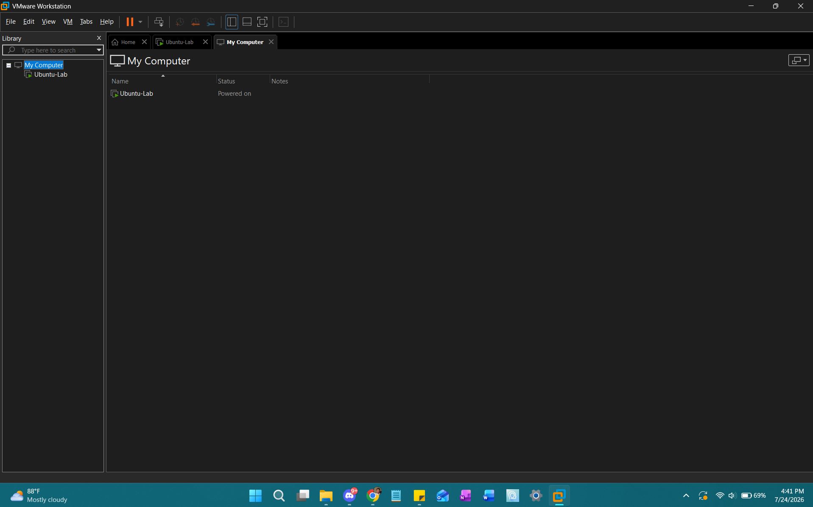

# VMware Workstation

## Objective

Install VMware Workstation Pro and understand virtualization.

## Concepts Learned

- Host
- Guest
- Hypervisor
- ISO
- Virtual Hard Disk

## Screenshots

## Challenges

Navigating the Broadcom website to download VMware Workstation Pro.

## Lessons Learned

VMware Workstation Pro is a hypervisor that creates and manages virtual machines. It allocates hardware resources from the physical host, such as CPU, RAM, storage, and networking, to each guest VM.

ISO files are digital copies of operating system installation media. The virtual machine boots from the ISO, and the installer copies the operating system onto its virtual hard disk. After installation, the VM can boot from the virtual hard disk without needing the ISO.
