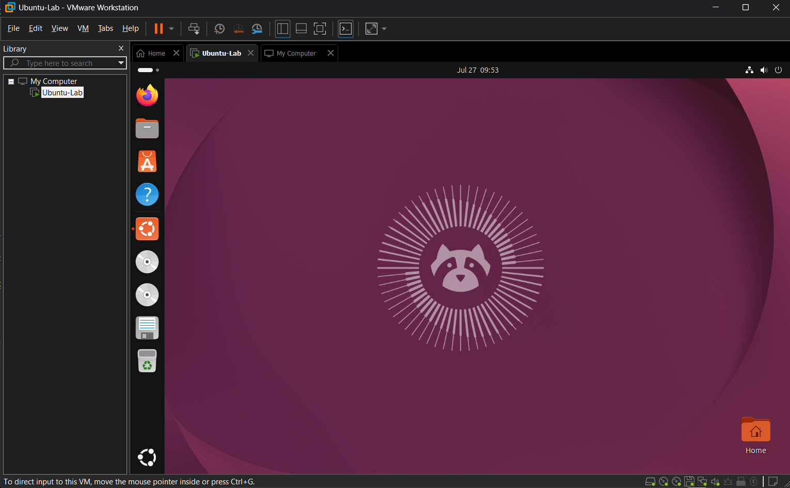

# Ubuntu Desktop Installation

## Objective

Install Ubuntu in a virtual machine to begin learning Linux administration and command-line fundamentals.

## Installation Environment

- Host computer: Windows laptop
- Hypervisor: VMware Workstation Pro
- Guest operating system: Ubuntu Desktop
- Installation media: Ubuntu Desktop ISO file
- Virtual memory: 4 GB RAM
- Virtual processors: 2
- Virtual disk size: 40 GB

## Installation Choices

- Selected interactive installation
- Selected the default application package
- Installed recommended third-party software
- Selected **Erase disk and install Ubuntu**
- Left disk encryption disabled
- Left Active Directory integration disabled

## Screenshots

## Lessons Learned

- The Ubuntu ISO served as bootable installation media for the virtual machine.
- The VM booted from the ISO and launched the Ubuntu installer.
- The installer copied Ubuntu onto the VM's virtual hard disk.
- The virtual hard disk is stored as a file on the physical host computer.
- Erasing the virtual disk did not erase or modify the physical laptop's disk.
- After installation, Ubuntu booted from the virtual hard disk instead of the ISO.
- The ISO was no longer required after the installation was completed.
