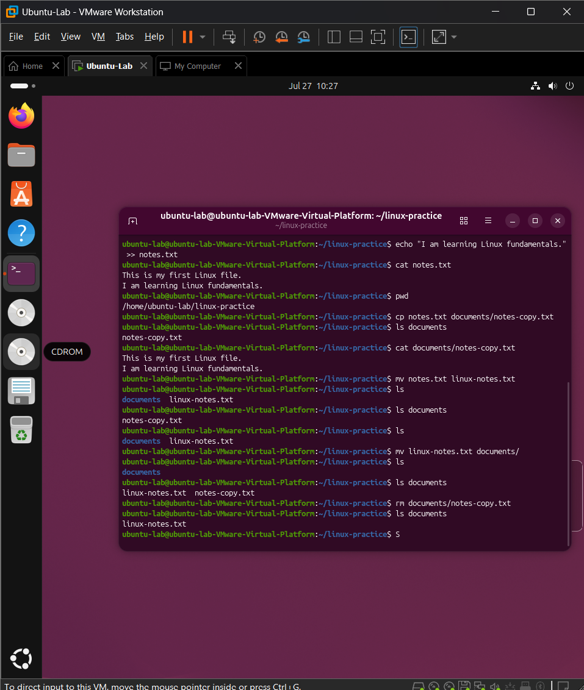
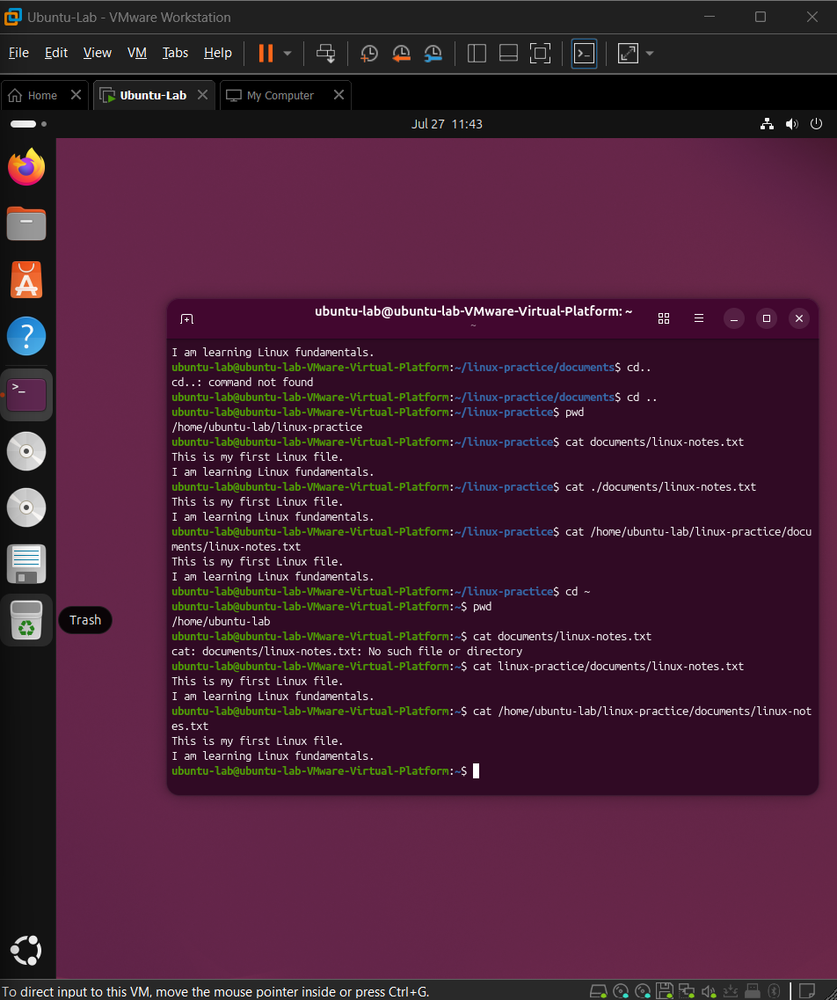

## Relative and Absolute Paths

### Objective

Learn how to locate files and directories using relative and absolute paths.

### Concepts Learned

- Relative paths
- Absolute paths
- Current directory '.'
- Parent directory '..'
- Root directory '/'
- Home directory '~'

### Hands-On Practice

- Created a practice dir called 'linux-practice' containing documents containing 'linux-notes.txt'
- Located files or dirs using '.' and '..' in commands.

### Challenge and Solution

I tried 'cat documents/linux-notes.txt', but I got the error 'No such file or dir'. This command looked for it at current dir: /home/ubuntu-lab, but it was actually a sub dir there: linux-practice/documents/linux-notes.txt. (Shown on 2nd screenshot)

### Screenshot

### Lessons Learned

The organization of dirs work like a tree branch. You must know where you are on the branch and you cannot jump from one branch to another without following the path from where it connects from and to.
